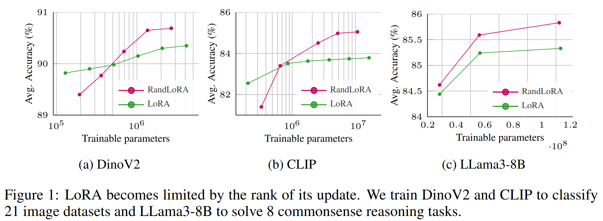

# RandLoRA: Full-Rank Parameter-Efficient Fine-Tuning of Large Models

**RandLoRA introduces a novel parameter-efficient fine-tuning method that achieves full-rank updates by learning linear combinations of low-rank random matrices, overcoming some limitations of standard Low-Rank Adaptation (LoRA).**

This repository contains the official code for RandLoRA, including an **unofficial** integration with the Hugging Face [PEFT](https://github.com/huggingface/peft) and [Transformers](https://github.com/huggingface/transformers) libraries.

**Read the preprint to learn more about RandLoRA:** [Preprint](https://arxiv.org/abs/2502.00987)

[[`Paper`](https://arxiv.org/abs/2502.00987)] [[`Website`](https://paulalbert31.github.io/RandLoRA_projectpage/)] [[`BibTeX`](#citation)]



## Abstract

> Low-Rank Adaptation (LoRA) and its variants have shown impressive results in reducing the number of trainable parameters and memory requirements of large
transformer networks while maintaining fine-tuning performance. However, the low-rank nature of the weight update inherently limits the representation power of the fine-tuned model, potentially compromising performance on complex tasks. This raises a critical question: when a performance gap between LoRA and
standard fine-tuning is observed, is it due to the reduced number of trainable parameters or the rank deficiency?
This paper aims to answer this question by introducing RandLoRA, a parameter-efficient method that performs full-rank updates using a learned linear combinations of low-rank, non-trainable random matrices. Our method limits the number of trainable parameters by restricting optimization to diagonal scaling matrices applied to the fixed random matrices. This allows us to effectively overcome low-rank limitations while maintaining low parameter count and memory usage during training.
Through extensive experimentation across vision, language, and vision-language benchmarks, we systematically evaluate the limitations of LoRA and existing random basis methods. Our findings reveal that full-rank updates are beneficial across vision and language tasks separately, but especially so for vision-language tasks, where RandLoRA significantly reduces—and sometimes eliminates—the performance gap between standard finetuning and LoRA, demonstrating its efficacy.

## Quickstart

1. Clone: `git clone https://github.com/PaulAlbert31/RandLoRA.git && cd RandLoRA`
2. Environment: `conda create -n randlora_peft python=3.12 && conda activate randlora_peft`
3. PyTorch: See [pytorch.org](https://pytorch.org/get-started/locally/) for your CUDA version, example: `conda install pytorch torchvision torchaudio pytorch-cuda=11.8 -c pytorch -c nvidia` (adjust as needed)
4. Dependencies: `pip install transformers accelerate`

### Usage Examples

Here's a basic example of how you might use RandLoRA's PEFT integration:

```python
import sys
import os
import torch

# --- Quick Start with RandLoRA ---

# 1. **Setup:** Ensure 'peft' and 'transformers' are accessible. Adjust paths if needed for local versions.
sys.path.append(os.path.join(os.getcwd(), "peft/src/"))
from peft import RandLoraConfig, get_peft_model, prepare_model_for_kbit_training
sys.path.append(os.path.join(os.getcwd(), "transformers"))
from transformers import AutoModelForCausalLM

# 2. **Configuration:** Define RandLoRA parameters and the base model.
seed = 1
rank = 30
load_4bit = False
base_model = 'meta-llama/Meta-Llama-3-8B'

config = RandLoraConfig(
    r=rank,
    randlora_alpha=2*rank,
    randlora_dropout=0.05,
    target_modules=["q_proj", "k_proj", "v_proj", "up_proj", "down_proj"],
    bias="none",
    task_type="CAUSAL_LM",
    projection_prng_key=int(torch.exp(torch.tensor(seed))*3.1415*1000),
)

# 3. **Load Model:** Load the base model, optionally in 4-bit.
model = AutoModelForCausalLM.from_pretrained(
    base_model,
    load_in_4bit=load_4bit,
    torch_dtype=torch.float16,
    trust_remote_code=True,
)

# 4. **Prepare for 4-bit (Optional):** If using 4-bit, prepare for training.
if load_4bit:
    model = prepare_model_for_kbit_training(model)

# 5. **Apply RandLoRA:**  Add RandLoRA adapters to the model.
model.gradient_checkpointing_enable()
model = get_peft_model(model, config)

# 6. **Ready to Go:** The `model` is now configured with RandLoRA.
print(model)
```

## Loss landscape visualization

You can now reproduce the 3D loss landscapes in the paper using the [loss_vis.sh](vision_language/loss_vis.sh) script.
The [loss_barrier.py](vision_language/loss_barrier.py) will save the result as an html file in the current folder and open a tab in your browser.

## Reproducing the Results

This section guides you on how to reproduce the results presented in the paper. Each subdirectory corresponds to a specific benchmark or task.

**Before you begin:**

* **Ensure you have followed the installation instructions.**
* **You might need to download and preprocess specific datasets** for each task. Please refer to the individual README files or scripts within each directory for dataset preparation details.

### Language ([commonsense_reasoning](commonsense_reasoning/))

This directory contains the code and scripts to reproduce the RandLoRA results on commonsense reasoning tasks.

### Vision Language ([vision_language](vision_language/))

The `vision_language/` directory contains the code to reproduce the paper's results on vision-language tasks.

### GLUE ([GLUE](GLUE/))

The `GLUE/` directory provides the scripts and configurations for reproducing the RandLoRA results on the General Language Understanding Evaluation (GLUE) benchmark.

### Natural Language Generation (NLG) ([NLG](NLG/))

The `NLG/` directory contains the code for reproducing RandLoRA results on natural language generation tasks.

**Important:** Please refer to the individual README files within each subdirectory for more detailed instructions, specific dataset preparation steps, and available configuration options.

## Citation

If your work benefited from our research, please consider citing our paper.

```bibtex
@article{2024_ICLR_RandLoRA,
  title={RandLoRA: full rank parameter-efficient fine-tuning of large models},
  author={Albert, Paul and Zhang, Frederic Z and Rodriguez-Opazo, Cristian and Saratchandran, Hemanth and Hengel, Anton van den and Abbasnejad, Ehsan},
  journal={International Conference on Learning Representations (ICLR)},
  year={2024}
}
```